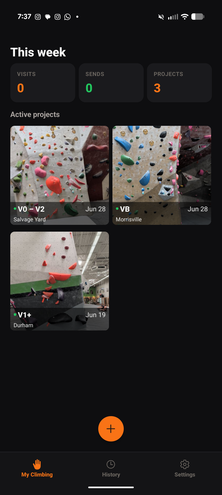
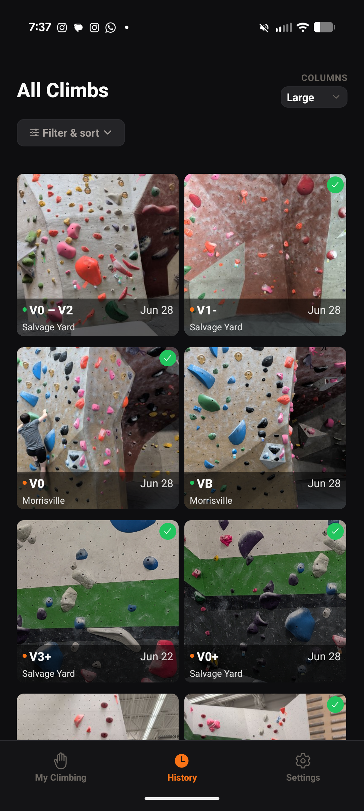
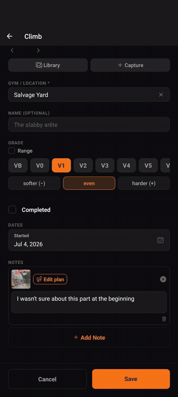

# It's A Rock

An offline-first Android app for tracking bouldering progress across multiple
gyms. Photograph a climb, tag it with a grade and the gym it's at, track whether
you've sent it or are still projecting it — and plan the beta move by move.

There is **no account, no backend, and no network dependency** for core use.
All data lives in on-device SQLite. The only network call is the optional
in-app update check.

See [docs/BLUEPRINT.md](docs/BLUEPRINT.md) for the full design and the work
breakdown.

## Screenshots

| My Climbing | History |
| ----------- | ------- |
|  |  |

### Planning a route

Mark your hands and feet on the climb's photo, sequence the moves, and play the
beta back move by move.



## Features

- **Visual, tile-driven log** — the photo of the climb is the primary content.
  Browse everything as a photo grid with adjustable column density.
- **Three tabs** — **My Climbing** (this-week Visits / Sends / Projects stats +
  your active projects + a floating `+` to add a climb), **History** (every
  climb, with filter & sort), and **Settings**.
- **Climbs** — each has an optional photo, grade (V-scale with `+`/`-`),
  gym/location, start and send dates, and a sent/projecting status.
- **Media galleries** — attach multiple **photos and videos** to a climb, not
  just a single cover shot.
- **Multiple notes per climb** — keep several beta notes, and attach a photo or
  video to any of them. View notes as rows or as a grid.
- **Move-by-move beta planner** — from a note's photo, mark your hands and feet,
  sequence the moves, and play the sequence back. Markers use real hand/foot
  icons with numbered badges and a resizable bubble size.
- **Light/dark theme** with a user-controlled toggle (Light / Dark / System).
- **In-app updates** — optional update check against this repo's GitHub
  Releases, plus a "What's New" sheet after an update.

## Tech stack

- **Expo** (SDK ~55), **React Native** 0.83.x, new architecture
- **TypeScript** ~5.9 (`strict`)
- **expo-router** (file-based navigation, typed routes)
- **zustand** for state, **expo-sqlite** (sync API, WAL) for persistence
- **@react-native-async-storage/async-storage** for local prefs
- **expo-image-picker** + **expo-media-library** for photos, **expo-video** for
  video capture/playback
- **react-native-gesture-handler** + **react-native-reanimated** for the
  planner canvas (pan/pinch, draggable limb markers)
- **expo-haptics** for tactile feedback

## Getting started

```sh
npm install
npm start          # launch the Expo dev server
npm run android    # build & run on a connected Android device/emulator
```

## Quality

```sh
npm run typecheck  # tsc --noEmit
npm test           # Jest: unit (ts-jest/node) + ui (jest-expo/jsdom)
```

Convention: `*.test.ts` → `unit` project, `*.test.tsx` → `ui` project.

## Project layout

```
app/              expo-router routes
  (tabs)/         My Climbing, History, Settings
  routes/         add climb (new) + climb detail/edit ([id])
  plan/           move-by-move beta planner ([routeId])
  releases.tsx    in-app update / release notes
src/
  components/     shared UI (tiles, grid, forms, notes, media)
    plan/         planner canvas, limb markers, move list, playback
  constants/      theme palettes, grades, limbs
  db/             SQLite database + query layer
  store/          zustand stores (routes, settings, plan, updates, confirm)
  theme/          ThemeProvider + useTheme
  hooks/          shared hooks
  types/          shared TypeScript types
  utils/          pure logic (grades, stats, dates, plan sequence, validators)
```

## License

Released under the [MIT License](LICENSE) — free to use, modify, and
redistribute.
